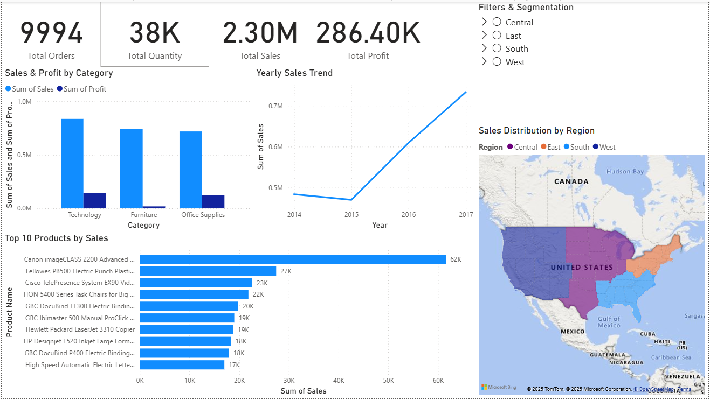
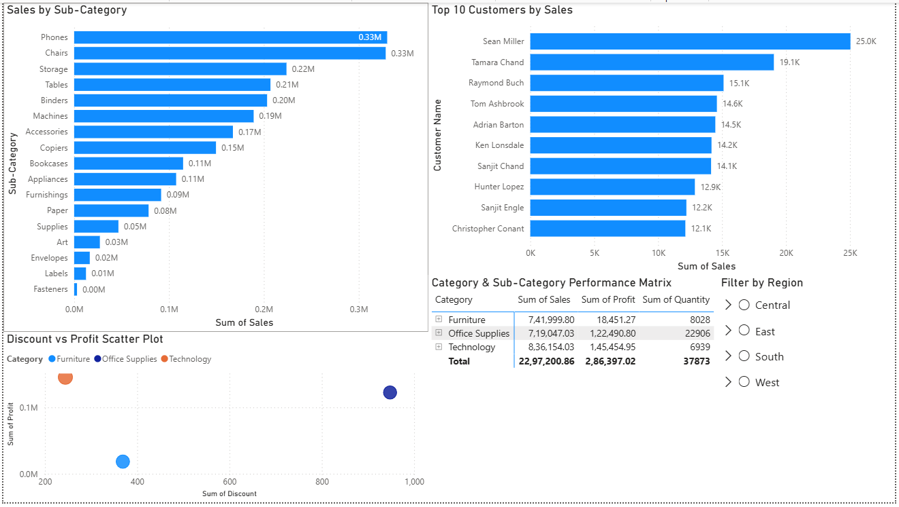
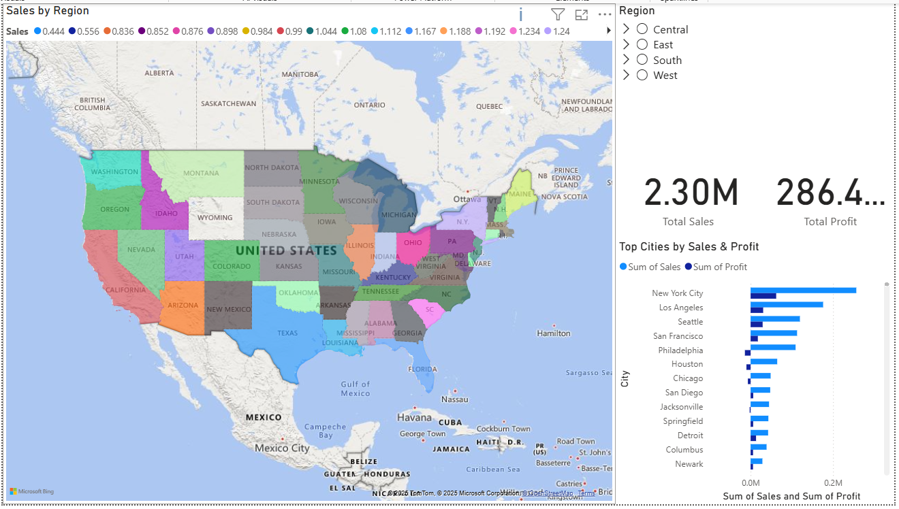

# 🏪 Superstore Sales Performance Analysis Dashboard

    

### Dashboard Overview

### Customer & Product Analysis

### Geographic Analysis

## 🗂️ Table of Contents

1.🎯 Project Objective & Summary

2.📦 Problem Statement & Business Problem

3.📌 Business Objectives

4.🧾 Project Overview 

    5.⚙️ Project Setup, Code Organization & Usage
    ├── 🏗️ Project Setup
    ├── 💻 Installation Instructions
    ├── 📂 Folder Structure & Code Organization & Implementation
    ├── ▶️ Usage / How to Run
    └── 🌐 Live Demo / Deployment Link

6.🧩 Dataset Information (Data Source, Data Details & Data Dictionary)

7.🧰 Tools,Technologies & Skills Used

8.🧮 Steps / Methodology / Approach

9.🐍 Code / Implementation (Python)

10.🧠 Exploratory Data Analysis (EDA) & Visualizations

11.📝 SQL Analysis (MySQL)

12.📈 Analysis, Modeling & Dashboard Creation (Power BI)
    
13.💡 Key Insights, Findings & Business Takeaways

14.❓ Key Questions to Answer

15.🚀 Challenges, Gotchas & Learnings

16.🗂 Deliverables

17.🗄️ Business Impact

18.⚙️ Skills Demonstrated

19.📚 References & Resources

20.👨‍💻 Authors / Contributors

21.📜 License

22.🏁 Conclusion

## Step 1 :🎯 Project Objective & Summary

The main objective of this project is to build an end-to-end Sales Performance Analysis & Dashboard using the Superstore dataset, covering:

* Data Cleaning & Preparation in Python (handling duplicates, missing values, formatting, feature creation).

* Exploratory Data Analysis (EDA) to understand patterns in sales, profit, discounts, and customer behavior.

* SQL-based Analysis to replicate realistic business queries in a database environment.

* Power BI Dashboard with multiple pages (Overview, Customer & Product, Geographic) for interactive analysis.

In short, this project simulates a real-world analytics workflow – from raw CSV to polished dashboard and business insights.

## Step 2 :📦 Problem Statement & Business Problem

Retail businesses often struggle to clearly understand which regions, products, and customer segments drive revenue and profit, and where they are losing money due to heavy discounts, slow shipping, or unprofitable categories. Raw transactional data alone doesn’t answer questions like:

* Which regions and states are performing well or poorly?

* Which product categories generate revenue but not profit?

* How do discounts affect margin and bottom-line profit?

* Which customers or products should be prioritized or optimized?

The company wants to track:

* Which regions and states have the highest and lowest sales

* Which product categories are most profitable

* Sales performance over time (monthly/quarterly/yearly trends)

* Top 10 products by sales

This project tackles that problem by transforming the raw Superstore sales dataset into clean insights and an interactive dashboard that management can actually use for decision-making.

## Step 3.📌 Business Objectives 

This project is designed to support business stakeholders (Sales, Marketing, Operations) by answering key performance questions, including:

* Identify top-performing and underperforming regions, states, and cities.

* Analyze category and sub-category performance in terms of sales and profit.

* Understand the impact of discounts on profitability and detect loss-making combinations.

* Discover top customers and products by revenue and profit contribution.

* Track sales trends over time (monthly, yearly, seasonal patterns such as Q4 peaks).

* Provide a single dashboard view where decision-makers can slice and filter data by region, category, segment, and time.

## Step 4.🧾 Project Overview 

This project presents a complete end-to-end Sales Performance Analysis using the popular Sample Superstore dataset (2014–2017).
It showcases the full lifecycle of a real-world data analytics project — from data cleaning to exploration to visual storytelling through dashboards.

The analysis is performed using:

* SQL for data exploration

* Python for EDA & visualization 

* Power BI for building an interactive sales performance dashboard

The primary goal is to derive actionable business insights that help understand sales behavior, profitability, customer segments, and regional performance.

### Key Objectives

This project aims to uncover meaningful business insights, including:

* Sales trends over time

* Profitability by region, category, and sub-category

* Impact of discounts on profit margins

* Customer segmentation and buying patterns

* Regional performance analysis

* Category and product-level insights

### Final Output

An interactive Power BI dashboard that helps analyze sales performance by:

* Region

* Category & sub-category

* Time period

* Customer segments

* Discount levels

This dashboard provides a data-driven view to support strategic decision-making and improve business outcomes.

### Deliverables

* Clean dataset (data/clean/superstore_clean.csv)

* Jupyter notebooks (EDA + Cleaning)

* Power BI / Tableau dashboards

* Dashboard preview images

## Step 5.⚙️ Project Setup, Code Organization & Usage
           ├── 🏗️ Project Setup
           ├── 💻 Installation Instructions
           ├── 📂 Folder Structure & Code Organization & Implementation
           ├── ▶️ Usage / How to Run
           └── 🌐 Live Demo / Deployment Link

### 🏗️ Project Setup

Clone the repository to your local machine:

git clone https://github.com/<your-username>/superstore-sales-dashboard.git

cd superstore-sales-dashboard

### 💻 Installation Instructions

### To set up and run the project locally:

### 1. Clone the repository:

git clone https://github.com/<your-username>/sales_dashboard_superstore.git
cd sales_dashboard_superstore

### 2. Create and activate a virtual environment (recommended but optional):

python -m venv .venv

### Windows

.\.venv\Scripts\activate

### macOS / Linux

source .venv/bin/activate

### 3. Install Python dependencies:

pip install -r requirements.txt

### 4. Ensure you have the required tools installed:

* Python 3.8+

* Jupyter Notebook / JupyterLab

* MySQL Workbench (optional, for SQL part)

* Power BI Desktop (for dashboard)

### 📂 Folder Structure & Code Organization & Implementation

### 🗂 Folder Structure

    sales_dashboard_superstore/
    ├── data/        → Raw and cleaned CSV files  
    ├── notebooks/   → Python cleaning & EDA notebooks  
    ├── sql/         → SQL exploration queries  
    ├── powerbi/     → PBIX dashboard file  
    ├── images/      → Dashboard screenshots  
    └── README.md
  
### 🗂 Organize Folder Structure

    sales_dashboard_superstore/
    ├── data/
    │   ├── raw/
    │   │   └── Sample_Superstore.csv
    │   └── clean/
    │       └── superstore_clean.csv
    │
    ├── notebooks/
    │   ├── 01_data_cleaning.ipynb
    │   └── 02_eda_superstore.ipynb
    │
    ├── sql/
    │   └── 01_data_exploration.sql
    │
    ├── powerbi/
    │   └── Superstore_Sales_Dashboard.pbix
    │
    ├── images/
    │   ├── dashboard_overview.png
    │   ├── dashboard_customer_product.png
    │   └── dashboard_geographic.png
    │
    └── README.md
 
### ▶️ Usage / How to Run

### 1.Start Jupyter Notebook:

jupyter notebook

Once Jupyter opens in your browser, navigate to the notebooks/ folder and run the notebooks in the following order:

1.Data Cleaning

notebooks/01_data_cleaning.ipynb

2.Exploratory Data Analysis (EDA)

notebooks/02_eda_superstore.ipynb

### 2. SQL Analysis (Optional but recommended):

* Open MySQL Workbench.

* Create database and import the cleaned CSV as superstore_sales.

* Run the queries from:

    * sql/01_data_exploration.sql

### 3. Open the Power BI Dashboard:

* Open Power BI Desktop.

* Load:

    * powerbi/Superstore_Sales_Dashboard.pbix

### 4. View Dashboard Screenshots (if not using Power BI):

* Go to:

    * images/dashboard_overview.png

    * images/dashboard_customer_product.png

    * images/dashboard_geographic.png

### 🌐 Live Demo / Deployment Link

(Optional — add Power BI service link if published)
https://app.powerbi.com/...

## Step 6.🧩 Dataset Information (Data Source, Data Details & Data Dictionary)

* Dataset Source: Superstore Dataset by Vivek468 on Kaggle

* Format: CSV

* Dataset Size: 9,994 rows and 21 columns

* Type: Retail sales transactional dataset

* Usage: This is the exact dataset used in this project

### 📂 Files Used in the Project

* Sample_Superstore.csv — Original dataset downloaded from Kaggle

* superstore_clean.csv — Cleaned dataset prepared after data cleaning (Python)

### 🏷️ Key Columns (Complete List)

#### 🧾 Order & Shipping Details

* Order ID

* Order Date

* Ship Date

* Ship Mode

#### 📦 Product Information

* Product ID

* Product Name

* Category

* Sub-Category

#### 👤 Customer Information

* Customer ID

* Customer Name

* Segment

#### 🌍 Geographical Columns

* City

* State

* Region

* Postal Code

* Country (if present)

#### 💰 Sales Metrics

* Sales

* Profit

* Quantity

* Discount 

## Step 7.🧰 Tools,Technologies & Skills Used

* Python — Data cleaning, preparation, exploratory data analysis

* Libraries: Pandas, NumPy, Matplotlib, Seaborn

* SQL (MySQL) — Quick exploration, summary metrics, business queries

* Power BI — Interactive dashboard creation, visual storytelling

* Excel — Initial inspection, quick validation

* DAX (Power BI) — KPI creation, calculated fields

* Markdown / GitHub — Documentation, portfolio building

### 🧰 Tools & Technologies Used by Project Phase 

This project follows a structured data analysis workflow, using the right tools at each stage of the pipeline.

#### 🧹 Data Cleaning & Inspection

##### Python (Pandas, NumPy)
* Handled missing values and inconsistent data
* Cleaned column formats and data types

##### Excel
* Performed quick validation and initial inspection

#### 🔍 Exploratory Data Analysis (EDA)

##### Python (Matplotlib, Seaborn)
* Analyzed trends and patterns
* Visualized distributions and correlations
* Identified outliers and data anomalies

#### 🗃 Database & SQL Analysis
##### MySQL
* Executed aggregation and filtering queries
* Extracted key business metrics
* Answered analytical business questions

#### 📊 Dashboard Development
##### Power BI
* Designed interactive dashboards
* Built visual storytelling for insights
* Enabled dynamic filtering and drill-downs

#### 📈 KPI & Metrics Calculation
##### DAX (Power BI)
* Created calculated measures (Sales, Profit, YoY Growth)
* Developed business KPIs for decision-making

#### 📝 Documentation & Version Control
##### Markdown (README.md)
* Documented project workflow and findings

##### GitHub
* Managed version control
* Showcased project portfolio

### 📌 Final Consolidated Tool List

* Python (Pandas, NumPy, Matplotlib, Seaborn)

* SQL (MySQL)

* Power BI

* Excel

* DAX (for KPIs)

* Markdown / GitHub

## Step 8.🧮 Steps / Methodology / Approach

The project follows a structured analytics workflow:

1️⃣ Data Collection

2️⃣ Data Cleaning

3️⃣ Data Validation

4️⃣ Exploratory Data Analysis

5️⃣ SQL-based Business Queries

6️⃣ Dashboard Creation

7️⃣ Business Insights

## Step 9.🐍 Code / Implementation (Python)

Data Inspection (Notebook — `01_data_inspection.ipynb`)  

In this stage, the raw dataset was loaded and examined for quality issues.  

**Tasks performed:**
- Checked for missing and duplicate records  
- Verified data types (numeric, date, categorical)  
- Standardized column names and formats  
- Cleaned invalid or inconsistent values  
- Exported final cleaned data as `superstore_clean.csv`  

## Step 10.🧠 Exploratory Data Analysis (EDA)

EDA - (Notebook — `02_eda_superstore.ipynb`)  

EDA was performed to understand **sales patterns, profitability, and customer behavior** using visual insights.  

**Key Analyses:**
- Distribution of Sales, Profit, and Quantity  
- Monthly & Quarterly Sales Trends  
- Correlation Heatmap (Sales vs Discount vs Profit)  
- Top 10 Products, Customers, and Categories  
- Regional Sales Comparison  
- Category and Sub-Category Performance  

**Libraries Used:** `Pandas`, `Matplotlib`, `Seaborn`  

## Step 11.📝 SQL Analysis (MySQL)(`data_exploration.sql`)  

To simulate a database environment, all cleaned data was imported into **MySQL** as a table named `superstore_sales`.

**Queries performed included:**
1. View first few records  
2. Total number of records  
3. Total Sales, Quantity, and Profit  
4. Count of unique Customers, Products, Regions  
5. Sales by Region  
6. Top 10 Customers by Sales  
7. Sales by Category & Sub-Category  
8. Monthly Sales Trend  
9. Average Shipping Time (Days)  
10. Most Profitable Products  

## Step 12.📈 Analysis, Modeling & Dashboard Creation (Power BI)
            
📊 Dashboard Screenshots
            
An interactive dashboard was designed in Power BI to visually present all KPIs and insights derived from Python & SQL.

### Dashboard Pages

1️⃣ Overview Dashboard

images/dashboard_overview.png

Displays overall performance metrics — total sales, profit, orders, and category trends.

2️⃣ Customer & Product Insights

images/dashboard_customer_product.png

Highlights top-performing customers, product categories, and profit margins.

3️⃣ Geographic Insights

images/dashboard_geographic.png

Provides regional and state-level sales analysis across the United States.

## Step 13.💡 Key Insights, Findings & Business Takeaways

### 🔹Key Insights

#### 📅 Sales Trend

* Q4 shows the highest sales peak due to festive demand and year-end purchases.

* Monthly trend indicates steady growth across the years.

### 🌎 Regional Performance
* West region contributes the highest sales, but also has higher discount-related losses.

* Central region has a better profit margin despite lower overall sales.

* East region also performs strongly in revenue.

### 🏷️ Category & Sub-Category Analysis
* Technology category generates the highest profit.

* Office Supplies drives the highest number of orders, but with lower profit per order.

* Furniture sub-categories like Tables and Bookcases often result in negative profit, especially under heavy discounts.

### 📦 Product-Level Insights
* Top 10 products contribute a significant portion of total revenue.

* Several low-selling items have stable profit margins — good for long-term retention.

### 💰 Discount Impact
* Higher discount levels are directly associated with reduced profitability.

* Scatter plots show clusters of high discount + negative profit cases, especially in Furniture.

### 👥 Customer Insights

* A small percentage of customers contribute majority of total revenue (Pareto pattern).

* Opportunity to develop loyalty programs for top-performing customers.

🧠 Business Takeaways  

* Sales analysis shows a clear spike in revenue during Q4 every year. The company should plan inventory, staffing, and marketing campaigns in advance to fully capitalize on this seasonal demand.

* Regional performance indicates that the West and East regions contribute the majority of sales, while the South and Central regions lag behind. Focused strategies such as regional promotions, better distribution, and localized marketing can help improve performance in underperforming regions.

* Category-level analysis reveals that Technology and Office Supplies are the strongest revenue drivers. Introducing bundled offers, cross-selling, and targeted promotions within these categories can further increase sales.

* The discount strategy shows that offering high discounts negatively impacts overall profit margins. The company should optimize discount policies by limiting deep discounts and using data-driven pricing strategies to protect profitability.

* Customer insights indicate that a small group of customers contributes a large share of total revenue. Implementing loyalty programs, personalized offers, and retention strategies will help maintain long-term customer value and reduce dependency on a few buyers.

## Step 14.❓ Key Questions to Answer

1️⃣ Which regions generate the highest sales?

Answer: 

* The West region generates the highest total sales, contributing a significant portion of overall revenue.

* However, the Central region shows relatively better profit margins, indicating more efficient pricing and discount strategies.

Business Insight:

* The company should continue investing in the West region while optimizing profitability through controlled discount strategies.

2️⃣ Which product categories generate the most profit?

Answer:

* The Technology category produces the highest overall profit, especially products like phones and copiers.

* Meanwhile, Furniture often generates lower profit margins, mainly due to heavy discounting.

Business Insight:

* The company should focus on expanding technology product offerings while reviewing pricing strategies for furniture products.

3️⃣ How do discounts affect profitability?

Answer:

* Analysis shows that higher discounts are strongly associated with lower or negative profit values, especially within the Furniture category.

Business Insight:

* The company should optimize discount strategies and avoid excessive discounts that reduce profitability.

4️⃣ Which customers contribute the most revenue?

Answer:

* A small group of customers contributes a large portion of total revenue, indicating a Pareto (80/20) pattern.

Business Insight:

* The company should create loyalty programs or targeted promotions for high-value customers to retain them.

5️⃣ Are there seasonal sales trends?

Answer:

* Sales data shows consistent spikes during Q4 each year, indicating strong seasonal demand during the holiday period.

Business Insight:

* The company should increase marketing campaigns and inventory planning before Q4 to maximize revenue.

## Step 15.🚀 Challenges, Gotchas & Learnings

### Challenges faced:

* Handling different dataset variants of Superstore with slightly different columns and formats.

* Dealing with negative profits and understanding that they often represent returns or over-discounting, not “bad data”.

* Managing date-related fields consistently across Python, SQL, and Power BI (date formats, year-month, hierarchies).

* Designing a dashboard that is informative but not overloaded, with clear titles, filters, and consistent formatting.

### Key learnings:

* Importance of cleaning and standardizing data before visualization (dates, strings, numeric types).

* How discount policies can hurt profitability even when sales look strong.

* How different tools complement each other: Python for EDA, SQL for structured queries, Power BI for storytelling.

## Step 16.🗂 Deliverables

This project includes the following deliverables as part of the complete end-to-end analytics workflow:

### 📁 Data Files

* Raw dataset: data/raw/Sample_Superstore.csv

* Cleaned dataset: data/clean/superstore_clean.csv

### 📓 Jupyter Notebooks

* 01_data_inspection.ipynb — Data loading, validation, cleaning, preprocessing

* 02_eda_superstore.ipynb — Exploratory Data Analysis (EDA), visual insights, trends & distributions

### 🗄 SQL Scripts
* 01_data_exploration.sql — SQL queries for sales trends, customer insights, profitability, and regional analysis

### 📊 Power BI Dashboard
* Superstore_Sales_Dashboard.pbix — Fully interactive 3-page dashboard (Overview, Customer/Product Insights, Geographic Insights)

### 🖼 Dashboard Preview Images

* images/dashboard_overview.png

* images/dashboard_customer_product.png

* images/dashboard_geographic.png

### 📘 Documentation
* README.md — Complete project documentation

* LICENSE — MIT License (or chosen license type)

* requirements.txt — List of Python dependencies

* .gitignore — Ignore unnecessary project files

Step 17.🗄️ Business Impact:

* If deployed in a real retail or e-commerce environment, this analysis could help:
Increase profit margins by identifying where heavy discounts are destroying profit.

* Improve regional strategy by focusing on high-potential but underperforming regions or states.

* Optimize product portfolio by highlighting high-revenue but low-profit categories (e.g., Furniture with high sales but low/negative margins).

* Strengthen customer strategy by recognizing high-value customers for loyalty programs and targeted campaigns.

* Support demand planning by using seasonal and Q4 peak sales trends for inventory and staffing decisions.

* The dashboard turns raw data into actionable recommendations that can directly influence pricing, discount policies, inventory, and marketing focus.

## Step 18.⚙️ Skills Demonstrated

### 🧹 Data Cleaning & Transformation

* Performed in 01_data_inspection.ipynb

* Handled missing values, corrected data types, validated fields

* Used Pandas & NumPy for preprocessing

### 🔍 Exploratory Data Analysis (EDA)

* Conducted in 02_eda_superstore.ipynb

* Trend analysis, distribution patterns, outlier detection

* Visualized using Matplotlib & Seaborn

### 🗃️ SQL Analytics

* Business questions and KPIs explored in data_exploration.sql

* Used MySQL queries for:

   * Sales aggregation

   * Profitability comparisons

   * Regional & category-level insights

### 📊 Power BI Dashboard

* Designed a fully interactive dashboard with:

    * KPIs (Sales, Profit, Quantity, Profit Ratio)

    * Sales & Profit Trends

    * Regional Performance

    * Category & Sub-Category Insights

    * Discount vs Profit analysis

### 📝 Documentation

* Created a clear, structured, portfolio-ready README

* Included dataset link, insights, workflow, visuals, and business takeaways

* Version control maintained using Git & GitHub

## Steps 19.📚 References & Resources

Kaggle Superstore Dataset

Power BI Documentation

Pandas Documentation

Matplotlib Documentation

MySQL Documentation

## Steps 20.👨‍💻 Authors / Contributors

Suriya Prakash K M 

💼 Data Analyst 

📊 Data professional focused on transforming raw data into meaningful insights through data analysis, visualization, and business intelligence solutions.

📫 Contact:

📧 Email: suriyasanchez@gmail.com

📍 Location: Bangalore , India

💼 LinkedIn: https://www.linkedin.com/in/suriya-prakash-km/

## Steps 21.📜 License

This project is licensed under the MIT License.

* You are free to use, copy, modify, merge, publish, distribute, sublicense, and/or sell copies of the software.

* The only conditions are that you must include the original copyright notice and the license text.

👉 The full license text is available in the LICENSE file in this repository.

## Steps 22.🏁 Conclusion

This project encapsulates a complete business analytics workflow, integrating multiple tools to extract, analyze, and visualize insights from retail sales data.

**🎯 Goal achieved:** To understand how data-driven decision-making improves sales performance, customer targeting, and profitability.

### 🧩 Deliverables Completed

✔️ Dataset setup & cleaning

✔️ SQL exploration & insights

✔️ Power BI dashboard (3 pages)

✔️ GitHub repository

✔️ README.md file

