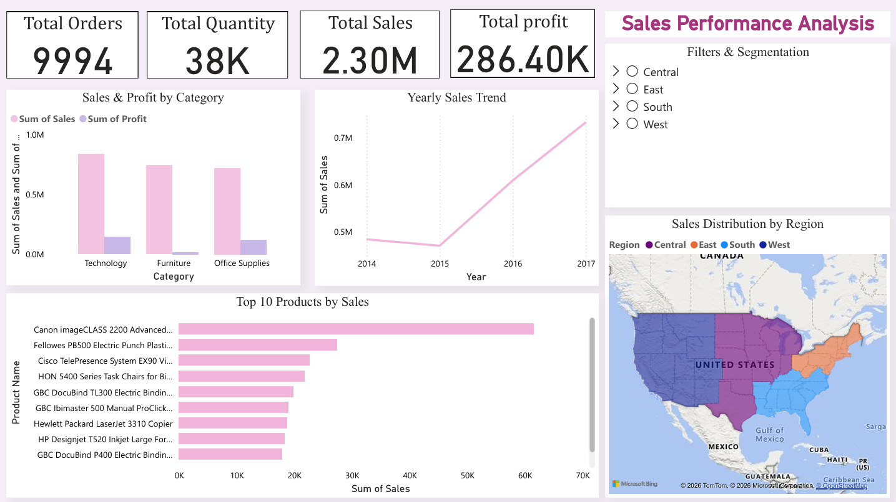
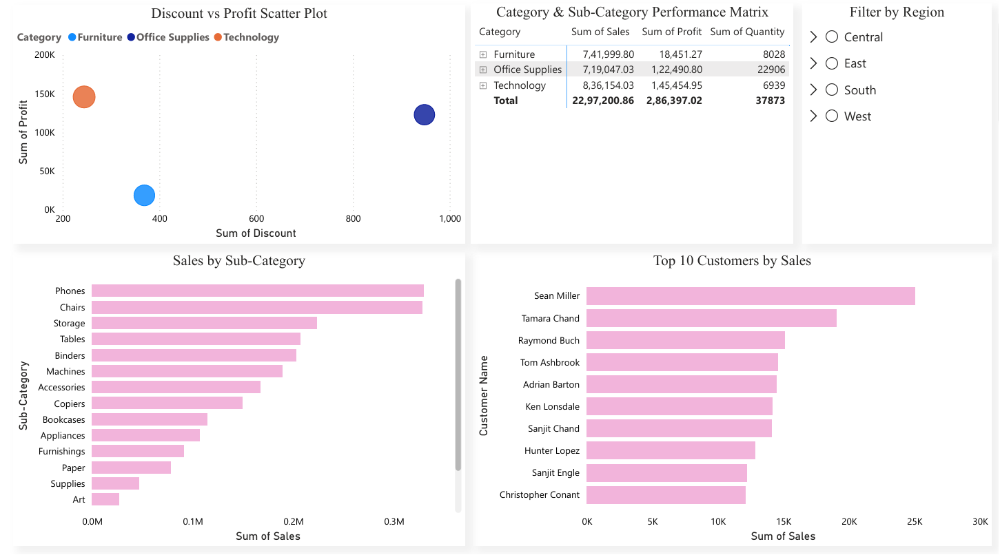
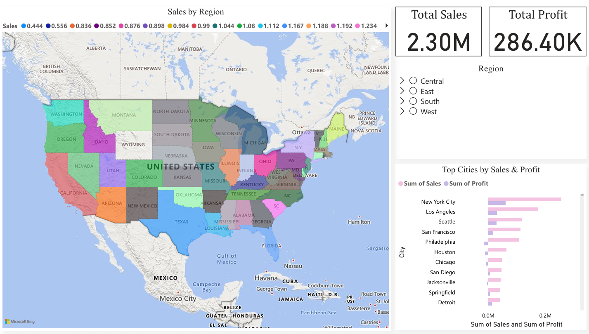

# Superstore Sales Dashboard

## 🔹 Project Overview
This project demonstrates a **complete Sales Performance Analysis** using the Sample Superstore dataset.  
It includes **data cleaning, SQL exploration, Python EDA, and an interactive Power BI dashboard** to derive actionable business insights.

## 🔹 Tools & Skills Used
- **Python (Pandas, Matplotlib, Seaborn)** — Data cleaning & EDA  
- **SQL (MySQL)** — Quick data exploration  
- **Power BI** — Interactive dashboard visualization  
- **Excel** — Initial data exploration & verification  

## 🔹 Dataset
- Source: [Superstore Dataset by Vivek468 on Kaggle](https://www.kaggle.com/datasets/vivek468/superstore-dataset-final?utm_source=chatgpt.com)  
- Format: CSV  
- Key columns: `Order Date`, `Sales`, `Profit`, `Quantity`, `Category`, `Sub-Category`, `Region`, `State`, `Customer_Name`, `Product_Name`, `Discount`

## 🔹 Key Insights
1. **Sales Trend:** Peak sales occur in Q4; monthly trend shows consistent growth.  
2. **Top Products:** Top 10 products contribute the majority of revenue.  
3. **Regional Performance:** West and East regions generate highest sales.  
4. **Category Analysis:** Technology and Office Supplies are top-selling categories.  
5. **Discount Impact:** Higher discounts sometimes reduce profitability, visible in Profit vs Discount scatter.

## 🔹 Dashboard Preview

### 1️⃣ Overview Page

### 2️⃣ Customer & Product Insights

### 3️⃣ Geographic Insights

## 🔹 Folder Structure
├── data/        → Raw and cleaned CSV files  
├── notebooks/   → Python cleaning & EDA notebooks  
├── sql/         → SQL exploration queries  
├── powerbi/     → PBIX dashboard file  
├── images/      → Dashboard screenshots
└── README.md

## 🔹 Author
Suriya Prakash  

